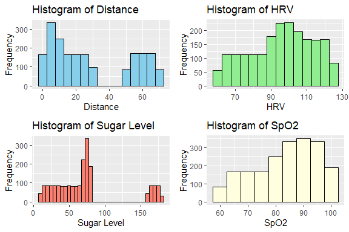

Elderly Fall Prediction
================
Trevor Okinda
2024

- [Student Details](#student-details)
- [Setup Chunk](#setup-chunk)
  - [Source:](#source)
  - [Reference:](#reference)
- [Exploratory Data Analysis](#exploratory-data-analysis)
  - [Load dataset](#load-dataset)
  - [Measures of Frequency](#measures-of-frequency)
  - [Measures of Central Tendency](#measures-of-central-tendency)
  - [Measures of Distribution](#measures-of-distribution)
  - [Measures of Relationship](#measures-of-relationship)
  - [ANOVA](#anova)
  - [Plots](#plots)
- [Preprocessing and Data
  Transformation](#preprocessing-and-data-transformation)
  - [Missing Values](#missing-values)
  - [Transformation](#transformation)
- [Training Models](#training-models)
  - [Data splitting](#data-splitting)
  - [Bootstrapping](#bootstrapping)
  - [RF Model](#rf-model)
  - [GBM Model](#gbm-model)
  - [SVR Model](#svr-model)
  - [Performance Comparison](#performance-comparison)
  - [Saving Model](#saving-model)

# Student Details

|                       |                         |
|-----------------------|-------------------------|
| **Student ID Number** | 134780                  |
| **Student Name**      | Trevor Okinda           |
| **BBIT 4.2 Group**    | C                       |
| **Project Name**      | Elderly Fall Prediction |

# Setup Chunk

**Note:** the following KnitR options have been set as the global
defaults: <BR>
`knitr::opts_chunk$set(echo = TRUE, warning = FALSE, eval = TRUE, collapse = FALSE, tidy = TRUE)`.

More KnitR options are documented here
<https://bookdown.org/yihui/rmarkdown-cookbook/chunk-options.html> and
here <https://yihui.org/knitr/options/>.

### Source:

The dataset that was used can be downloaded here: *\<<a
href="https://www.kaggle.com/datasets/laavanya/elderly-fall-prediction-and-detection?select=cStick.csv\"
class="uri">https://www.kaggle.com/datasets/laavanya/elderly-fall-prediction-and-detection?select=cStick.csv\</a>\>*

### Reference:

*\<Rachakonda, L. (2021). Elderly Fall Prediction and Detection Dataset.
Retrieved from
<https://www.kaggle.com/datasets/laavanya/elderly-fall-prediction-and-detection?select=cStick.csv>
\>  
Refer to the APA 7th edition manual for rules on how to cite datasets:
<https://apastyle.apa.org/style-grammar-guidelines/references/examples/data-set-references>*

# Exploratory Data Analysis

## Load dataset

``` r
# Load dataset
elderly_fall_data <- read.csv("elderly.csv", colClasses = c(
  Distance = "numeric",
  Pressure = "factor",
  HRV = "numeric",
  Sugar_level = "numeric",
  SpO2 = "numeric",
  Accelerometer = "factor",
  Decision = "factor"
))

# Display the structure of the dataset
str(elderly_fall_data)
```

    ## 'data.frame':    2039 obs. of  7 variables:
    ##  $ Distance     : num  25.5 2.6 68.1 13.1 69.4 ...
    ##  $ Pressure     : Factor w/ 3 levels "0","1","2": 2 3 1 2 1 2 1 1 1 2 ...
    ##  $ HRV          : num  101.4 110.2 87.4 92.3 89.5 ...
    ##  $ Sugar_level  : num  61.1 20.2 79.3 36.2 80 ...
    ##  $ SpO2         : num  87.8 65.2 99.3 81.5 100 ...
    ##  $ Accelerometer: Factor w/ 2 levels "0","1": 2 2 1 2 1 2 1 1 1 2 ...
    ##  $ Decision     : Factor w/ 3 levels "0","1","2": 2 3 1 2 1 2 1 1 1 2 ...

``` r
# View the first few rows of the dataset
head(elderly_fall_data)
```

    ##   Distance Pressure     HRV Sugar_level   SpO2 Accelerometer Decision
    ## 1   25.540        1 101.396      61.080 87.770             1        1
    ## 2    2.595        2 110.190      20.207 65.190             1        2
    ## 3   68.067        0  87.412      79.345 99.345             0        0
    ## 4   13.090        1  92.266      36.180 81.545             1        1
    ## 5   69.430        0  89.480      80.000 99.990             0        0
    ## 6   27.160        1 102.584      64.320 88.580             1        1

``` r
# View the dataset in a separate viewer window
View(elderly_fall_data)
```

## Measures of Frequency

``` r
# Calculate counts and percentages for Pressure levels
pressure_freq <- table(elderly_fall_data$Pressure)
pressure_percent <- prop.table(pressure_freq) * 100

# Calculate counts and percentages for Accelerometer readings
accelerometer_freq <- table(elderly_fall_data$Accelerometer)
accelerometer_percent <- prop.table(accelerometer_freq) * 100

# Calculate counts and percentages for Decision outcomes
decision_freq <- table(elderly_fall_data$Decision)
decision_percent <- prop.table(decision_freq) * 100

# Display the frequency tables
cat("Frequency of Pressure levels:\n")
```

    ## Frequency of Pressure levels:

``` r
print(pressure_freq)
```

    ## 
    ##   0   1   2 
    ## 690 682 667

``` r
cat("\nPercentage of Pressure levels:\n")
```

    ## 
    ## Percentage of Pressure levels:

``` r
print(pressure_percent)
```

    ## 
    ##        0        1        2 
    ## 33.84012 33.44777 32.71211

``` r
cat("\nFrequency of Accelerometer readings:\n")
```

    ## 
    ## Frequency of Accelerometer readings:

``` r
print(accelerometer_freq)
```

    ## 
    ##    0    1 
    ##  690 1349

``` r
cat("\nPercentage of Accelerometer readings:\n")
```

    ## 
    ## Percentage of Accelerometer readings:

``` r
print(accelerometer_percent)
```

    ## 
    ##        0        1 
    ## 33.84012 66.15988

``` r
cat("\nFrequency of Decision outcomes:\n")
```

    ## 
    ## Frequency of Decision outcomes:

``` r
print(decision_freq)
```

    ## 
    ##   0   1   2 
    ## 690 682 667

``` r
cat("\nPercentage of Decision outcomes:\n")
```

    ## 
    ## Percentage of Decision outcomes:

``` r
print(decision_percent)
```

    ## 
    ##        0        1        2 
    ## 33.84012 33.44777 32.71211

## Measures of Central Tendency

``` r
# Calculate measures of central tendency for Distance
distance_mean <- mean(elderly_fall_data$Distance)
distance_median <- median(elderly_fall_data$Distance)
distance_mode <- as.numeric(names(sort(table(elderly_fall_data$Distance), decreasing = TRUE)[1]))

# Calculate measures of central tendency for HRV
hrv_mean <- mean(elderly_fall_data$HRV)
hrv_median <- median(elderly_fall_data$HRV)
hrv_mode <- as.numeric(names(sort(table(elderly_fall_data$HRV), decreasing = TRUE)[1]))

# Display the measures of central tendency
cat("Measures of Central Tendency for Distance:\n")
```

    ## Measures of Central Tendency for Distance:

``` r
cat("Mean:", distance_mean, "\n")
```

    ## Mean: 28.69453

``` r
cat("Median:", distance_median, "\n")
```

    ## Median: 20.56

``` r
cat("Mode:", distance_mode, "\n\n")
```

    ## Mode: 29.98

``` r
cat("Measures of Central Tendency for HRV:\n")
```

    ## Measures of Central Tendency for HRV:

``` r
cat("Mean:", hrv_mean, "\n")
```

    ## Mean: 95.657

``` r
cat("Median:", hrv_median, "\n")
```

    ## Median: 97.238

``` r
cat("Mode:", hrv_mode, "\n\n")
```

    ## Mode: 89.964

## Measures of Distribution

``` r
# Calculate Measures of Distribution for Distance
distance_range <- range(elderly_fall_data$Distance)
distance_variance <- var(elderly_fall_data$Distance)
distance_sd <- sd(elderly_fall_data$Distance)
distance_quantiles <- quantile(elderly_fall_data$Distance, probs = c(0.25, 0.5, 0.75))

# Calculate Measures of Distribution for HRV
hrv_range <- range(elderly_fall_data$HRV)
hrv_variance <- var(elderly_fall_data$HRV)
hrv_sd <- sd(elderly_fall_data$HRV)
hrv_quantiles <- quantile(elderly_fall_data$HRV, probs = c(0.25, 0.5, 0.75))


# Display the Measures of Distribution
cat("Measures of Distribution for Distance:\n")
```

    ## Measures of Distribution for Distance:

``` r
cat("Range:", distance_range, "\n")
```

    ## Range: 0 69.981

``` r
cat("Variance:", distance_variance, "\n")
```

    ## Variance: 565.1862

``` r
cat("Standard Deviation:", distance_sd, "\n")
```

    ## Standard Deviation: 23.77364

``` r
cat("Quantiles (25th, 50th, 75th):", distance_quantiles, "\n\n")
```

    ## Quantiles (25th, 50th, 75th): 7.6425 20.56 55.2055

``` r
cat("Measures of Distribution for HRV:\n")
```

    ## Measures of Distribution for HRV:

``` r
cat("Range:", hrv_range, "\n")
```

    ## Range: 60 124.98

``` r
cat("Variance:", hrv_variance, "\n")
```

    ## Variance: 308.9333

``` r
cat("Standard Deviation:", hrv_sd, "\n")
```

    ## Standard Deviation: 17.5765

``` r
cat("Quantiles (25th, 50th, 75th):", hrv_quantiles, "\n\n")
```

    ## Quantiles (25th, 50th, 75th): 82.418 97.238 109.695

## Measures of Relationship

``` r
# Calculate correlation coefficients for numerical variables
correlation_matrix <- cor(elderly_fall_data[c("Distance", "HRV", "Sugar_level", "SpO2")])

# Display correlation matrix
cat("Correlation Matrix for Numerical Variables:\n")
```

    ## Correlation Matrix for Numerical Variables:

``` r
print(correlation_matrix)
```

    ##               Distance        HRV Sugar_level        SpO2
    ## Distance     1.0000000 -0.8166651  0.01834430  0.91192948
    ## HRV         -0.8166651  1.0000000  0.30921224 -0.72407964
    ## Sugar_level  0.0183443  0.3092122  1.00000000  0.09193278
    ## SpO2         0.9119295 -0.7240796  0.09193278  1.00000000

``` r
# Calculate contingency table for Pressure and Decision
pressure_decision_table <- table(elderly_fall_data$Pressure, elderly_fall_data$Decision)

# Display contingency table
cat("\nContingency Table for Pressure and Decision:\n")
```

    ## 
    ## Contingency Table for Pressure and Decision:

``` r
print(pressure_decision_table)
```

    ##    
    ##       0   1   2
    ##   0 690   0   0
    ##   1   0 682   0
    ##   2   0   0 667

``` r
# Calculate contingency table for Accelerometer and Decision
accelerometer_decision_table <- table(elderly_fall_data$Accelerometer, elderly_fall_data$Decision)

# Display contingency table
cat("\nContingency Table for Accelerometer and Decision:\n")
```

    ## 
    ## Contingency Table for Accelerometer and Decision:

``` r
print(accelerometer_decision_table)
```

    ##    
    ##       0   1   2
    ##   0 690   0   0
    ##   1   0 682 667

## ANOVA

``` r
# Load the required library for ANOVA
library(stats)

# Perform ANOVA for Distance across different levels of Pressure
anova_result <- aov(Distance ~ Pressure, data = elderly_fall_data)

# Summary of ANOVA results
summary(anova_result)
```

    ##               Df  Sum Sq Mean Sq F value Pr(>F)    
    ## Pressure       2 1099543  549771   21400 <2e-16 ***
    ## Residuals   2036   52306      26                   
    ## ---
    ## Signif. codes:  0 '***' 0.001 '**' 0.01 '*' 0.05 '.' 0.1 ' ' 1

## Plots

``` r
# Load the required library for plotting
library(ggplot2)

# Create histograms for numerical variables
distance_plot <- ggplot(elderly_fall_data, aes(x = Distance)) +
  geom_histogram(binwidth = 5, fill = "skyblue", color = "black") +
  labs(title = "Histogram of Distance", x = "Distance", y = "Frequency")

hrv_plot <- ggplot(elderly_fall_data, aes(x = HRV)) +
  geom_histogram(binwidth = 5, fill = "lightgreen", color = "black") +
  labs(title = "Histogram of HRV", x = "HRV", y = "Frequency")

sugar_level_plot <- ggplot(elderly_fall_data, aes(x = Sugar_level)) +
  geom_histogram(binwidth = 5, fill = "salmon", color = "black") +
  labs(title = "Histogram of Sugar Level", x = "Sugar Level", y = "Frequency")

spo2_plot <- ggplot(elderly_fall_data, aes(x = SpO2)) +
  geom_histogram(binwidth = 5, fill = "lightyellow", color = "black") +
  labs(title = "Histogram of SpO2", x = "SpO2", y = "Frequency")

# Load the required library for arranging plots
library(gridExtra)

# Combine plots into a single display
grid.arrange(distance_plot, hrv_plot, sugar_level_plot, spo2_plot, ncol = 2)
```

<!-- -->

``` r
# Create box plot for Distance across different Pressure levels
distance_pressure_plot <- ggplot(elderly_fall_data, aes(x = Pressure, y = Distance, fill = Pressure)) +
  geom_boxplot() +
  labs(title = "Box Plot of Distance by Pressure Levels", x = "Pressure", y = "Distance")

# Create box plot for HRV across different Pressure levels
hrv_pressure_plot <- ggplot(elderly_fall_data, aes(x = Pressure, y = HRV, fill = Pressure)) +
  geom_boxplot() +
  labs(title = "Box Plot of HRV by Pressure Levels", x = "Pressure", y = "HRV")

# Create violin plot for Sugar Level across different Pressure levels
sugar_pressure_plot <- ggplot(elderly_fall_data, aes(x = Pressure, y = Sugar_level, fill = Pressure)) +
  geom_violin() +
  labs(title = "Violin Plot of Sugar Level by Pressure Levels", x = "Pressure", y = "Sugar Level")

# Create violin plot for SpO2 across different Pressure levels
spo2_pressure_plot <- ggplot(elderly_fall_data, aes(x = Pressure, y = SpO2, fill = Pressure)) +
  geom_violin() +
  labs(title = "Violin Plot of SpO2 by Pressure Levels", x = "Pressure", y = "SpO2")

# Combine plots into a single display
grid.arrange(distance_pressure_plot, hrv_pressure_plot, sugar_pressure_plot, spo2_pressure_plot, ncol = 2)
```

<!-- -->

# Preprocessing and Data Transformation

## Missing Values

``` r
# Count missing values in each column
missing_values <- colSums(is.na(elderly_fall_data))

# Display columns with missing values
print("Columns with Missing Values:")
```

    ## [1] "Columns with Missing Values:"

``` r
print(names(missing_values[missing_values > 0]))
```

    ## character(0)

``` r
# Display total number of missing values
print("Total Number of Missing Values:")
```

    ## [1] "Total Number of Missing Values:"

``` r
print(sum(missing_values))
```

    ## [1] 0

## Transformation

``` r
# Apply logarithmic transformation to Sugar_level variable
elderly_fall_data$Sugar_level_log <- log(elderly_fall_data$Sugar_level)

# Plot the histogram of the original and transformed Sugar_level variable
ggplot(elderly_fall_data, aes(x = Sugar_level)) +
  geom_histogram(binwidth = 5, fill = "salmon", color = "black") +
  labs(title = "Histogram of Original Sugar Level", x = "Sugar Level", y = "Frequency")
```

<!-- -->

``` r
ggplot(elderly_fall_data, aes(x = Sugar_level_log)) +
  geom_histogram(binwidth = 0.1, fill = "skyblue", color = "black") +
  labs(title = "Histogram of Transformed Sugar Level (Log)", x = "Log(Sugar Level)", y = "Frequency")
```

<!-- -->

# Training Models

## Data splitting

``` r
# Load the required library for data splitting
library(caret)
```

    ## Loading required package: lattice

``` r
# Set seed for reproducibility
set.seed(123)

# Specify the percentage of data to be allocated for testing (e.g., 80% training, 20% testing)
split_percentage <- 0.8

# Split the dataset into training and testing sets
training_index <- createDataPartition(elderly_fall_data$Decision, p = split_percentage, list = FALSE)
training_data <- elderly_fall_data[training_index, ]
testing_data <- elderly_fall_data[-training_index, ]

# Print the dimensions of the training and testing sets
print("Dimensions of the training set:")
```

    ## [1] "Dimensions of the training set:"

``` r
print(dim(training_data))
```

    ## [1] 1632    8

``` r
print("Dimensions of the testing set:")
```

    ## [1] "Dimensions of the testing set:"

``` r
print(dim(testing_data))
```

    ## [1] 407   8

## Bootstrapping

``` r
# Define the number of bootstrap samples
num_bootstraps <- 1000

# Create an empty vector to store bootstrap statistics
bootstrap_statistics <- numeric(num_bootstraps)

# Perform bootstrapping
for (i in 1:num_bootstraps) {
  # Resample the dataset with replacement
  bootstrap_sample <- elderly_fall_data[sample(nrow(elderly_fall_data), replace = TRUE), ]
  
  # Calculate the statistic of interest (e.g., mean, median, etc.)
  # For example, let's calculate the mean of the Distance variable
  bootstrap_statistics[i] <- mean(bootstrap_sample$Distance)
}

# Compute the confidence interval
confidence_interval <- quantile(bootstrap_statistics, c(0.025, 0.975))

# Print the confidence interval
print(confidence_interval)
```

    ##     2.5%    97.5% 
    ## 27.63447 29.73048

## RF Model

``` r
# Load required libraries
library(caret)
library(randomForest)
```

    ## randomForest 4.7-1.1

    ## Type rfNews() to see new features/changes/bug fixes.

    ## 
    ## Attaching package: 'randomForest'

    ## The following object is masked from 'package:gridExtra':
    ## 
    ##     combine

    ## The following object is masked from 'package:ggplot2':
    ## 
    ##     margin

``` r
# Define train control using cross-validation
train_control <- trainControl(method = "cv", number = 10)  # 10-fold cross-validation

# Train a Random Forest Regression model
rf_model <- train(Decision ~ ., data = elderly_fall_data, method = "rf", trControl = train_control)

# Print the trained Random Forest model
print(rf_model)
```

    ## Random Forest 
    ## 
    ## 2039 samples
    ##    7 predictor
    ##    3 classes: '0', '1', '2' 
    ## 
    ## No pre-processing
    ## Resampling: Cross-Validated (10 fold) 
    ## Summary of sample sizes: 1835, 1835, 1835, 1834, 1835, 1836, ... 
    ## Resampling results across tuning parameters:
    ## 
    ##   mtry  Accuracy  Kappa
    ##   2     1         1    
    ##   5     1         1    
    ##   8     1         1    
    ## 
    ## Accuracy was used to select the optimal model using the largest value.
    ## The final value used for the model was mtry = 2.

## GBM Model

``` r
# Load the required library for modeling
library(caret)

# Set seed for reproducibility
set.seed(123)

# Define the training control
train_control <- trainControl(method = "cv", number = 10)

# Train a Gradient Boosting Regression model
gbm_model <- train(Decision ~ ., data = elderly_fall_data, method = "gbm", trControl = train_control)
```

    ## Iter   TrainDeviance   ValidDeviance   StepSize   Improve
    ##      1        1.0986             nan     0.1000    0.4314
    ##      2        0.8221             nan     0.1000    0.2947
    ##      3        0.6335             nan     0.1000    0.2145
    ##      4        0.4965             nan     0.1000    0.1618
    ##      5        0.3932             nan     0.1000    0.1241
    ##      6        0.3139             nan     0.1000    0.0966
    ##      7        0.2519             nan     0.1000    0.0761
    ##      8        0.2031             nan     0.1000    0.0608
    ##      9        0.1642             nan     0.1000    0.0485
    ##     10        0.1331             nan     0.1000    0.0391
    ##     20        0.0174             nan     0.1000    0.0049
    ##     40        0.0003             nan     0.1000    0.0001
    ##     60        0.0000             nan     0.1000    0.0000
    ##     80        0.0000             nan     0.1000    0.0000
    ##    100        0.0000             nan     0.1000    0.0000
    ##    120        0.0000             nan     0.1000    0.0000
    ##    140        0.0000             nan     0.1000    0.0000
    ##    150        0.0000             nan     0.1000    0.0000
    ## 
    ## Iter   TrainDeviance   ValidDeviance   StepSize   Improve
    ##      1        1.0986             nan     0.1000    0.4324
    ##      2        0.8221             nan     0.1000    0.2942
    ##      3        0.6334             nan     0.1000    0.2147
    ##      4        0.4962             nan     0.1000    0.1615
    ##      5        0.3931             nan     0.1000    0.1245
    ##      6        0.3137             nan     0.1000    0.0965
    ##      7        0.2518             nan     0.1000    0.0765
    ##      8        0.2029             nan     0.1000    0.0606
    ##      9        0.1640             nan     0.1000    0.0485
    ##     10        0.1330             nan     0.1000    0.0389
    ##     20        0.0173             nan     0.1000    0.0049
    ##     40        0.0003             nan     0.1000    0.0001
    ##     60        0.0000             nan     0.1000    0.0000
    ##     80        0.0000             nan     0.1000    0.0000
    ##    100        0.0000             nan     0.1000    0.0000
    ##    120        0.0000             nan     0.1000    0.0000
    ##    140        0.0000             nan     0.1000    0.0000
    ##    150        0.0000             nan     0.1000    0.0000
    ## 
    ## Iter   TrainDeviance   ValidDeviance   StepSize   Improve
    ##      1        1.0986             nan     0.1000    0.4310
    ##      2        0.8221             nan     0.1000    0.2948
    ##      3        0.6336             nan     0.1000    0.2143
    ##      4        0.4965             nan     0.1000    0.1613
    ##      5        0.3932             nan     0.1000    0.1238
    ##      6        0.3139             nan     0.1000    0.0964
    ##      7        0.2520             nan     0.1000    0.0764
    ##      8        0.2031             nan     0.1000    0.0606
    ##      9        0.1643             nan     0.1000    0.0484
    ##     10        0.1332             nan     0.1000    0.0391
    ##     20        0.0174             nan     0.1000    0.0049
    ##     40        0.0003             nan     0.1000    0.0001
    ##     60        0.0000             nan     0.1000    0.0000
    ##     80        0.0000             nan     0.1000    0.0000
    ##    100        0.0000             nan     0.1000    0.0000
    ##    120        0.0000             nan     0.1000    0.0000
    ##    140        0.0000             nan     0.1000    0.0000
    ##    150        0.0000             nan     0.1000    0.0000
    ## 
    ## Iter   TrainDeviance   ValidDeviance   StepSize   Improve
    ##      1        1.0986             nan     0.1000    0.4326
    ##      2        0.8221             nan     0.1000    0.2949
    ##      3        0.6334             nan     0.1000    0.2139
    ##      4        0.4963             nan     0.1000    0.1617
    ##      5        0.3931             nan     0.1000    0.1239
    ##      6        0.3138             nan     0.1000    0.0965
    ##      7        0.2518             nan     0.1000    0.0762
    ##      8        0.2029             nan     0.1000    0.0606
    ##      9        0.1641             nan     0.1000    0.0486
    ##     10        0.1330             nan     0.1000    0.0390
    ##     20        0.0173             nan     0.1000    0.0049
    ##     40        0.0003             nan     0.1000    0.0001
    ##     60        0.0000             nan     0.1000    0.0000
    ##     80        0.0000             nan     0.1000    0.0000
    ##    100        0.0000             nan     0.1000    0.0000
    ##    120        0.0000             nan     0.1000    0.0000
    ##    140        0.0000             nan     0.1000    0.0000
    ##    150        0.0000             nan     0.1000    0.0000
    ## 
    ## Iter   TrainDeviance   ValidDeviance   StepSize   Improve
    ##      1        1.0986             nan     0.1000    0.4320
    ##      2        0.8221             nan     0.1000    0.2957
    ##      3        0.6334             nan     0.1000    0.2142
    ##      4        0.4963             nan     0.1000    0.1616
    ##      5        0.3931             nan     0.1000    0.1241
    ##      6        0.3137             nan     0.1000    0.0967
    ##      7        0.2517             nan     0.1000    0.0764
    ##      8        0.2029             nan     0.1000    0.0608
    ##      9        0.1640             nan     0.1000    0.0485
    ##     10        0.1330             nan     0.1000    0.0390
    ##     20        0.0174             nan     0.1000    0.0049
    ##     40        0.0003             nan     0.1000    0.0001
    ##     60        0.0000             nan     0.1000    0.0000
    ##     80        0.0000             nan     0.1000    0.0000
    ##    100        0.0000             nan     0.1000    0.0000
    ##    120        0.0000             nan     0.1000    0.0000
    ##    140        0.0000             nan     0.1000    0.0000
    ##    150        0.0000             nan     0.1000    0.0000
    ## 
    ## Iter   TrainDeviance   ValidDeviance   StepSize   Improve
    ##      1        1.0986             nan     0.1000    0.4293
    ##      2        0.8221             nan     0.1000    0.2947
    ##      3        0.6334             nan     0.1000    0.2140
    ##      4        0.4962             nan     0.1000    0.1615
    ##      5        0.3931             nan     0.1000    0.1245
    ##      6        0.3137             nan     0.1000    0.0969
    ##      7        0.2518             nan     0.1000    0.0763
    ##      8        0.2029             nan     0.1000    0.0606
    ##      9        0.1641             nan     0.1000    0.0485
    ##     10        0.1330             nan     0.1000    0.0390
    ##     20        0.0173             nan     0.1000    0.0049
    ##     40        0.0003             nan     0.1000    0.0001
    ##     60        0.0000             nan     0.1000    0.0000
    ##     80        0.0000             nan     0.1000    0.0000
    ##    100        0.0000             nan     0.1000    0.0000
    ##    120        0.0000             nan     0.1000    0.0000
    ##    140        0.0000             nan     0.1000    0.0000
    ##    150        0.0000             nan     0.1000    0.0000
    ## 
    ## Iter   TrainDeviance   ValidDeviance   StepSize   Improve
    ##      1        1.0986             nan     0.1000    0.4313
    ##      2        0.8221             nan     0.1000    0.2945
    ##      3        0.6337             nan     0.1000    0.2148
    ##      4        0.4966             nan     0.1000    0.1607
    ##      5        0.3933             nan     0.1000    0.1240
    ##      6        0.3139             nan     0.1000    0.0970
    ##      7        0.2519             nan     0.1000    0.0761
    ##      8        0.2031             nan     0.1000    0.0606
    ##      9        0.1642             nan     0.1000    0.0486
    ##     10        0.1331             nan     0.1000    0.0390
    ##     20        0.0174             nan     0.1000    0.0049
    ##     40        0.0003             nan     0.1000    0.0001
    ##     60        0.0000             nan     0.1000    0.0000
    ##     80        0.0000             nan     0.1000    0.0000
    ##    100        0.0000             nan     0.1000    0.0000
    ##    120        0.0000             nan     0.1000    0.0000
    ##    140        0.0000             nan     0.1000    0.0000
    ##    150        0.0000             nan     0.1000    0.0000
    ## 
    ## Iter   TrainDeviance   ValidDeviance   StepSize   Improve
    ##      1        1.0986             nan     0.1000    0.4325
    ##      2        0.8221             nan     0.1000    0.2952
    ##      3        0.6334             nan     0.1000    0.2149
    ##      4        0.4963             nan     0.1000    0.1619
    ##      5        0.3931             nan     0.1000    0.1240
    ##      6        0.3137             nan     0.1000    0.0969
    ##      7        0.2518             nan     0.1000    0.0764
    ##      8        0.2029             nan     0.1000    0.0607
    ##      9        0.1641             nan     0.1000    0.0486
    ##     10        0.1330             nan     0.1000    0.0390
    ##     20        0.0174             nan     0.1000    0.0049
    ##     40        0.0003             nan     0.1000    0.0001
    ##     60        0.0000             nan     0.1000    0.0000
    ##     80        0.0000             nan     0.1000    0.0000
    ##    100        0.0000             nan     0.1000    0.0000
    ##    120        0.0000             nan     0.1000    0.0000
    ##    140        0.0000             nan     0.1000    0.0000
    ##    150        0.0000             nan     0.1000    0.0000
    ## 
    ## Iter   TrainDeviance   ValidDeviance   StepSize   Improve
    ##      1        1.0986             nan     0.1000    0.4300
    ##      2        0.8221             nan     0.1000    0.2957
    ##      3        0.6334             nan     0.1000    0.2153
    ##      4        0.4963             nan     0.1000    0.1618
    ##      5        0.3932             nan     0.1000    0.1239
    ##      6        0.3138             nan     0.1000    0.0967
    ##      7        0.2518             nan     0.1000    0.0763
    ##      8        0.2029             nan     0.1000    0.0607
    ##      9        0.1641             nan     0.1000    0.0486
    ##     10        0.1330             nan     0.1000    0.0388
    ##     20        0.0174             nan     0.1000    0.0049
    ##     40        0.0003             nan     0.1000    0.0001
    ##     60        0.0000             nan     0.1000    0.0000
    ##     80        0.0000             nan     0.1000    0.0000
    ##    100        0.0000             nan     0.1000    0.0000
    ##    120        0.0000             nan     0.1000    0.0000
    ##    140        0.0000             nan     0.1000    0.0000
    ##    150        0.0000             nan     0.1000    0.0000
    ## 
    ## Iter   TrainDeviance   ValidDeviance   StepSize   Improve
    ##      1        1.0986             nan     0.1000    0.4321
    ##      2        0.8221             nan     0.1000    0.2962
    ##      3        0.6334             nan     0.1000    0.2143
    ##      4        0.4963             nan     0.1000    0.1615
    ##      5        0.3932             nan     0.1000    0.1242
    ##      6        0.3138             nan     0.1000    0.0965
    ##      7        0.2519             nan     0.1000    0.0764
    ##      8        0.2030             nan     0.1000    0.0608
    ##      9        0.1642             nan     0.1000    0.0485
    ##     10        0.1331             nan     0.1000    0.0391
    ##     20        0.0174             nan     0.1000    0.0049
    ##     40        0.0003             nan     0.1000    0.0001
    ##     60        0.0000             nan     0.1000    0.0000
    ##     80        0.0000             nan     0.1000    0.0000
    ##    100        0.0000             nan     0.1000    0.0000
    ##    120        0.0000             nan     0.1000    0.0000
    ##    140        0.0000             nan     0.1000    0.0000
    ##    150        0.0000             nan     0.1000    0.0000
    ## 
    ## Iter   TrainDeviance   ValidDeviance   StepSize   Improve
    ##      1        1.0986             nan     0.1000    0.4348
    ##      2        0.8221             nan     0.1000    0.2943
    ##      3        0.6337             nan     0.1000    0.2140
    ##      4        0.4965             nan     0.1000    0.1618
    ##      5        0.3932             nan     0.1000    0.1237
    ##      6        0.3138             nan     0.1000    0.0970
    ##      7        0.2519             nan     0.1000    0.0764
    ##      8        0.2030             nan     0.1000    0.0606
    ##      9        0.1641             nan     0.1000    0.0485
    ##     10        0.1330             nan     0.1000    0.0391
    ##     20        0.0174             nan     0.1000    0.0049
    ##     40        0.0003             nan     0.1000    0.0001
    ##     60        0.0000             nan     0.1000    0.0000
    ##     80        0.0000             nan     0.1000    0.0000
    ##    100        0.0000             nan     0.1000    0.0000
    ##    120        0.0000             nan     0.1000    0.0000
    ##    140        0.0000             nan     0.1000    0.0000
    ##    150        0.0000             nan     0.1000    0.0000
    ## 
    ## Iter   TrainDeviance   ValidDeviance   StepSize   Improve
    ##      1        1.0986             nan     0.1000    0.4319
    ##      2        0.8221             nan     0.1000    0.2939
    ##      3        0.6334             nan     0.1000    0.2149
    ##      4        0.4964             nan     0.1000    0.1603
    ##      5        0.3933             nan     0.1000    0.1242
    ##      6        0.3139             nan     0.1000    0.0967
    ##      7        0.2519             nan     0.1000    0.0764
    ##      8        0.2030             nan     0.1000    0.0609
    ##      9        0.1642             nan     0.1000    0.0485
    ##     10        0.1331             nan     0.1000    0.0391
    ##     20        0.0174             nan     0.1000    0.0049
    ##     40        0.0003             nan     0.1000    0.0001
    ##     60        0.0000             nan     0.1000    0.0000
    ##     80        0.0000             nan     0.1000    0.0000
    ##    100        0.0000             nan     0.1000    0.0000
    ##    120        0.0000             nan     0.1000    0.0000
    ##    140        0.0000             nan     0.1000    0.0000
    ##    150        0.0000             nan     0.1000    0.0000
    ## 
    ## Iter   TrainDeviance   ValidDeviance   StepSize   Improve
    ##      1        1.0986             nan     0.1000    0.4320
    ##      2        0.8221             nan     0.1000    0.2962
    ##      3        0.6335             nan     0.1000    0.2138
    ##      4        0.4963             nan     0.1000    0.1612
    ##      5        0.3931             nan     0.1000    0.1238
    ##      6        0.3139             nan     0.1000    0.0970
    ##      7        0.2519             nan     0.1000    0.0763
    ##      8        0.2030             nan     0.1000    0.0607
    ##      9        0.1642             nan     0.1000    0.0486
    ##     10        0.1331             nan     0.1000    0.0389
    ##     20        0.0174             nan     0.1000    0.0049
    ##     40        0.0003             nan     0.1000    0.0001
    ##     60        0.0000             nan     0.1000    0.0000
    ##     80        0.0000             nan     0.1000    0.0000
    ##    100        0.0000             nan     0.1000    0.0000
    ##    120        0.0000             nan     0.1000    0.0000
    ##    140        0.0000             nan     0.1000    0.0000
    ##    150        0.0000             nan     0.1000    0.0000
    ## 
    ## Iter   TrainDeviance   ValidDeviance   StepSize   Improve
    ##      1        1.0986             nan     0.1000    0.4313
    ##      2        0.8221             nan     0.1000    0.2957
    ##      3        0.6334             nan     0.1000    0.2139
    ##      4        0.4964             nan     0.1000    0.1612
    ##      5        0.3932             nan     0.1000    0.1242
    ##      6        0.3138             nan     0.1000    0.0968
    ##      7        0.2518             nan     0.1000    0.0763
    ##      8        0.2030             nan     0.1000    0.0607
    ##      9        0.1641             nan     0.1000    0.0484
    ##     10        0.1331             nan     0.1000    0.0389
    ##     20        0.0174             nan     0.1000    0.0049
    ##     40        0.0003             nan     0.1000    0.0001
    ##     60        0.0000             nan     0.1000    0.0000
    ##     80        0.0000             nan     0.1000    0.0000
    ##    100        0.0000             nan     0.1000    0.0000
    ##    120        0.0000             nan     0.1000    0.0000
    ##    140        0.0000             nan     0.1000    0.0000
    ##    150        0.0000             nan     0.1000    0.0000
    ## 
    ## Iter   TrainDeviance   ValidDeviance   StepSize   Improve
    ##      1        1.0986             nan     0.1000    0.4324
    ##      2        0.8221             nan     0.1000    0.2941
    ##      3        0.6335             nan     0.1000    0.2152
    ##      4        0.4963             nan     0.1000    0.1613
    ##      5        0.3931             nan     0.1000    0.1234
    ##      6        0.3139             nan     0.1000    0.0968
    ##      7        0.2519             nan     0.1000    0.0764
    ##      8        0.2030             nan     0.1000    0.0607
    ##      9        0.1642             nan     0.1000    0.0485
    ##     10        0.1331             nan     0.1000    0.0390
    ##     20        0.0174             nan     0.1000    0.0049
    ##     40        0.0003             nan     0.1000    0.0001
    ##     60        0.0000             nan     0.1000    0.0000
    ##     80        0.0000             nan     0.1000    0.0000
    ##    100        0.0000             nan     0.1000    0.0000
    ##    120        0.0000             nan     0.1000    0.0000
    ##    140        0.0000             nan     0.1000    0.0000
    ##    150        0.0000             nan     0.1000    0.0000
    ## 
    ## Iter   TrainDeviance   ValidDeviance   StepSize   Improve
    ##      1        1.0986             nan     0.1000    0.4322
    ##      2        0.8221             nan     0.1000    0.2961
    ##      3        0.6335             nan     0.1000    0.2149
    ##      4        0.4963             nan     0.1000    0.1612
    ##      5        0.3931             nan     0.1000    0.1243
    ##      6        0.3138             nan     0.1000    0.0966
    ##      7        0.2519             nan     0.1000    0.0766
    ##      8        0.2030             nan     0.1000    0.0607
    ##      9        0.1641             nan     0.1000    0.0484
    ##     10        0.1330             nan     0.1000    0.0390
    ##     20        0.0174             nan     0.1000    0.0049
    ##     40        0.0003             nan     0.1000    0.0001
    ##     60        0.0000             nan     0.1000    0.0000
    ##     80        0.0000             nan     0.1000    0.0000
    ##    100        0.0000             nan     0.1000    0.0000
    ##    120        0.0000             nan     0.1000    0.0000
    ##    140        0.0000             nan     0.1000    0.0000
    ##    150        0.0000             nan     0.1000    0.0000
    ## 
    ## Iter   TrainDeviance   ValidDeviance   StepSize   Improve
    ##      1        1.0986             nan     0.1000    0.4294
    ##      2        0.8221             nan     0.1000    0.2948
    ##      3        0.6334             nan     0.1000    0.2153
    ##      4        0.4963             nan     0.1000    0.1608
    ##      5        0.3932             nan     0.1000    0.1241
    ##      6        0.3138             nan     0.1000    0.0968
    ##      7        0.2518             nan     0.1000    0.0765
    ##      8        0.2030             nan     0.1000    0.0607
    ##      9        0.1641             nan     0.1000    0.0486
    ##     10        0.1330             nan     0.1000    0.0390
    ##     20        0.0173             nan     0.1000    0.0049
    ##     40        0.0003             nan     0.1000    0.0001
    ##     60        0.0000             nan     0.1000    0.0000
    ##     80        0.0000             nan     0.1000    0.0000
    ##    100        0.0000             nan     0.1000    0.0000
    ##    120        0.0000             nan     0.1000    0.0000
    ##    140        0.0000             nan     0.1000    0.0000
    ##    150        0.0000             nan     0.1000    0.0000
    ## 
    ## Iter   TrainDeviance   ValidDeviance   StepSize   Improve
    ##      1        1.0986             nan     0.1000    0.4325
    ##      2        0.8221             nan     0.1000    0.2949
    ##      3        0.6334             nan     0.1000    0.2138
    ##      4        0.4963             nan     0.1000    0.1615
    ##      5        0.3931             nan     0.1000    0.1243
    ##      6        0.3138             nan     0.1000    0.0968
    ##      7        0.2518             nan     0.1000    0.0764
    ##      8        0.2030             nan     0.1000    0.0607
    ##      9        0.1641             nan     0.1000    0.0485
    ##     10        0.1330             nan     0.1000    0.0389
    ##     20        0.0173             nan     0.1000    0.0049
    ##     40        0.0003             nan     0.1000    0.0001
    ##     60        0.0000             nan     0.1000    0.0000
    ##     80        0.0000             nan     0.1000    0.0000
    ##    100        0.0000             nan     0.1000    0.0000
    ##    120        0.0000             nan     0.1000    0.0000
    ##    140        0.0000             nan     0.1000    0.0000
    ##    150        0.0000             nan     0.1000    0.0000
    ## 
    ## Iter   TrainDeviance   ValidDeviance   StepSize   Improve
    ##      1        1.0986             nan     0.1000    0.4307
    ##      2        0.8221             nan     0.1000    0.2952
    ##      3        0.6334             nan     0.1000    0.2141
    ##      4        0.4963             nan     0.1000    0.1618
    ##      5        0.3931             nan     0.1000    0.1240
    ##      6        0.3137             nan     0.1000    0.0966
    ##      7        0.2518             nan     0.1000    0.0765
    ##      8        0.2030             nan     0.1000    0.0608
    ##      9        0.1641             nan     0.1000    0.0485
    ##     10        0.1330             nan     0.1000    0.0390
    ##     20        0.0174             nan     0.1000    0.0049
    ##     40        0.0003             nan     0.1000    0.0001
    ##     60        0.0000             nan     0.1000    0.0000
    ##     80        0.0000             nan     0.1000    0.0000
    ##    100        0.0000             nan     0.1000    0.0000
    ##    120        0.0000             nan     0.1000    0.0000
    ##    140        0.0000             nan     0.1000    0.0000
    ##    150        0.0000             nan     0.1000    0.0000
    ## 
    ## Iter   TrainDeviance   ValidDeviance   StepSize   Improve
    ##      1        1.0986             nan     0.1000    0.4316
    ##      2        0.8221             nan     0.1000    0.2941
    ##      3        0.6334             nan     0.1000    0.2141
    ##      4        0.4963             nan     0.1000    0.1620
    ##      5        0.3931             nan     0.1000    0.1239
    ##      6        0.3137             nan     0.1000    0.0970
    ##      7        0.2518             nan     0.1000    0.0766
    ##      8        0.2029             nan     0.1000    0.0607
    ##      9        0.1641             nan     0.1000    0.0485
    ##     10        0.1330             nan     0.1000    0.0386
    ##     20        0.0174             nan     0.1000    0.0049
    ##     40        0.0003             nan     0.1000    0.0001
    ##     60        0.0000             nan     0.1000    0.0000
    ##     80        0.0000             nan     0.1000    0.0000
    ##    100        0.0000             nan     0.1000    0.0000
    ##    120        0.0000             nan     0.1000    0.0000
    ##    140        0.0000             nan     0.1000    0.0000
    ##    150        0.0000             nan     0.1000    0.0000
    ## 
    ## Iter   TrainDeviance   ValidDeviance   StepSize   Improve
    ##      1        1.0986             nan     0.1000    0.4326
    ##      2        0.8221             nan     0.1000    0.2943
    ##      3        0.6337             nan     0.1000    0.2151
    ##      4        0.4964             nan     0.1000    0.1610
    ##      5        0.3932             nan     0.1000    0.1241
    ##      6        0.3139             nan     0.1000    0.0965
    ##      7        0.2519             nan     0.1000    0.0764
    ##      8        0.2030             nan     0.1000    0.0608
    ##      9        0.1641             nan     0.1000    0.0486
    ##     10        0.1330             nan     0.1000    0.0388
    ##     20        0.0174             nan     0.1000    0.0049
    ##     40        0.0003             nan     0.1000    0.0001
    ##     60        0.0000             nan     0.1000    0.0000
    ##     80        0.0000             nan     0.1000    0.0000
    ##    100        0.0000             nan     0.1000    0.0000
    ##    120        0.0000             nan     0.1000    0.0000
    ##    140        0.0000             nan     0.1000    0.0000
    ##    150        0.0000             nan     0.1000    0.0000
    ## 
    ## Iter   TrainDeviance   ValidDeviance   StepSize   Improve
    ##      1        1.0986             nan     0.1000    0.4328
    ##      2        0.8221             nan     0.1000    0.2946
    ##      3        0.6334             nan     0.1000    0.2144
    ##      4        0.4963             nan     0.1000    0.1612
    ##      5        0.3931             nan     0.1000    0.1240
    ##      6        0.3137             nan     0.1000    0.0970
    ##      7        0.2518             nan     0.1000    0.0765
    ##      8        0.2029             nan     0.1000    0.0608
    ##      9        0.1641             nan     0.1000    0.0485
    ##     10        0.1330             nan     0.1000    0.0390
    ##     20        0.0173             nan     0.1000    0.0049
    ##     40        0.0003             nan     0.1000    0.0001
    ##     60        0.0000             nan     0.1000    0.0000
    ##     80        0.0000             nan     0.1000    0.0000
    ##    100        0.0000             nan     0.1000    0.0000
    ##    120        0.0000             nan     0.1000    0.0000
    ##    140        0.0000             nan     0.1000    0.0000
    ##    150        0.0000             nan     0.1000    0.0000
    ## 
    ## Iter   TrainDeviance   ValidDeviance   StepSize   Improve
    ##      1        1.0986             nan     0.1000    0.4323
    ##      2        0.8221             nan     0.1000    0.2945
    ##      3        0.6334             nan     0.1000    0.2144
    ##      4        0.4963             nan     0.1000    0.1610
    ##      5        0.3931             nan     0.1000    0.1243
    ##      6        0.3138             nan     0.1000    0.0965
    ##      7        0.2518             nan     0.1000    0.0764
    ##      8        0.2029             nan     0.1000    0.0606
    ##      9        0.1641             nan     0.1000    0.0485
    ##     10        0.1330             nan     0.1000    0.0390
    ##     20        0.0174             nan     0.1000    0.0049
    ##     40        0.0003             nan     0.1000    0.0001
    ##     60        0.0000             nan     0.1000    0.0000
    ##     80        0.0000             nan     0.1000    0.0000
    ##    100        0.0000             nan     0.1000    0.0000
    ##    120        0.0000             nan     0.1000    0.0000
    ##    140        0.0000             nan     0.1000    0.0000
    ##    150        0.0000             nan     0.1000    0.0000
    ## 
    ## Iter   TrainDeviance   ValidDeviance   StepSize   Improve
    ##      1        1.0986             nan     0.1000    0.4305
    ##      2        0.8221             nan     0.1000    0.2940
    ##      3        0.6335             nan     0.1000    0.2141
    ##      4        0.4964             nan     0.1000    0.1610
    ##      5        0.3932             nan     0.1000    0.1242
    ##      6        0.3138             nan     0.1000    0.0964
    ##      7        0.2520             nan     0.1000    0.0765
    ##      8        0.2031             nan     0.1000    0.0608
    ##      9        0.1642             nan     0.1000    0.0486
    ##     10        0.1332             nan     0.1000    0.0390
    ##     20        0.0174             nan     0.1000    0.0050
    ##     40        0.0003             nan     0.1000    0.0001
    ##     60        0.0000             nan     0.1000    0.0000
    ##     80        0.0000             nan     0.1000    0.0000
    ##    100        0.0000             nan     0.1000    0.0000
    ##    120        0.0000             nan     0.1000    0.0000
    ##    140        0.0000             nan     0.1000    0.0000
    ##    150        0.0000             nan     0.1000    0.0000
    ## 
    ## Iter   TrainDeviance   ValidDeviance   StepSize   Improve
    ##      1        1.0986             nan     0.1000    0.4326
    ##      2        0.8221             nan     0.1000    0.2959
    ##      3        0.6334             nan     0.1000    0.2133
    ##      4        0.4963             nan     0.1000    0.1614
    ##      5        0.3932             nan     0.1000    0.1237
    ##      6        0.3138             nan     0.1000    0.0968
    ##      7        0.2518             nan     0.1000    0.0764
    ##      8        0.2030             nan     0.1000    0.0607
    ##      9        0.1641             nan     0.1000    0.0486
    ##     10        0.1330             nan     0.1000    0.0390
    ##     20        0.0174             nan     0.1000    0.0049
    ##     40        0.0003             nan     0.1000    0.0001
    ##     60        0.0000             nan     0.1000    0.0000
    ##     80        0.0000             nan     0.1000    0.0000
    ##    100        0.0000             nan     0.1000    0.0000
    ##    120        0.0000             nan     0.1000    0.0000
    ##    140        0.0000             nan     0.1000    0.0000
    ##    150        0.0000             nan     0.1000    0.0000
    ## 
    ## Iter   TrainDeviance   ValidDeviance   StepSize   Improve
    ##      1        1.0986             nan     0.1000    0.4313
    ##      2        0.8221             nan     0.1000    0.2948
    ##      3        0.6334             nan     0.1000    0.2147
    ##      4        0.4962             nan     0.1000    0.1616
    ##      5        0.3931             nan     0.1000    0.1239
    ##      6        0.3137             nan     0.1000    0.0967
    ##      7        0.2518             nan     0.1000    0.0763
    ##      8        0.2029             nan     0.1000    0.0605
    ##      9        0.1641             nan     0.1000    0.0481
    ##     10        0.1332             nan     0.1000    0.0390
    ##     20        0.0174             nan     0.1000    0.0049
    ##     40        0.0003             nan     0.1000    0.0001
    ##     60        0.0000             nan     0.1000    0.0000
    ##     80        0.0000             nan     0.1000    0.0000
    ##    100        0.0000             nan     0.1000    0.0000
    ##    120        0.0000             nan     0.1000    0.0000
    ##    140        0.0000             nan     0.1000    0.0000
    ##    150        0.0000             nan     0.1000    0.0000
    ## 
    ## Iter   TrainDeviance   ValidDeviance   StepSize   Improve
    ##      1        1.0986             nan     0.1000    0.4316
    ##      2        0.8221             nan     0.1000    0.2935
    ##      3        0.6335             nan     0.1000    0.2144
    ##      4        0.4963             nan     0.1000    0.1612
    ##      5        0.3932             nan     0.1000    0.1237
    ##      6        0.3138             nan     0.1000    0.0964
    ##      7        0.2519             nan     0.1000    0.0762
    ##      8        0.2030             nan     0.1000    0.0606
    ##      9        0.1641             nan     0.1000    0.0486
    ##     10        0.1330             nan     0.1000    0.0389
    ##     20        0.0174             nan     0.1000    0.0049
    ##     40        0.0003             nan     0.1000    0.0001
    ##     60        0.0000             nan     0.1000    0.0000
    ##     80        0.0000             nan     0.1000    0.0000
    ##    100        0.0000             nan     0.1000    0.0000
    ##    120        0.0000             nan     0.1000    0.0000
    ##    140        0.0000             nan     0.1000    0.0000
    ##    150        0.0000             nan     0.1000    0.0000
    ## 
    ## Iter   TrainDeviance   ValidDeviance   StepSize   Improve
    ##      1        1.0986             nan     0.1000    0.4315
    ##      2        0.8221             nan     0.1000    0.2952
    ##      3        0.6334             nan     0.1000    0.2152
    ##      4        0.4963             nan     0.1000    0.1612
    ##      5        0.3931             nan     0.1000    0.1237
    ##      6        0.3138             nan     0.1000    0.0967
    ##      7        0.2518             nan     0.1000    0.0764
    ##      8        0.2029             nan     0.1000    0.0605
    ##      9        0.1641             nan     0.1000    0.0487
    ##     10        0.1330             nan     0.1000    0.0390
    ##     20        0.0174             nan     0.1000    0.0049
    ##     40        0.0003             nan     0.1000    0.0001
    ##     60        0.0000             nan     0.1000    0.0000
    ##     80        0.0000             nan     0.1000    0.0000
    ##    100        0.0000             nan     0.1000    0.0000
    ##    120        0.0000             nan     0.1000    0.0000
    ##    140        0.0000             nan     0.1000    0.0000
    ##    150        0.0000             nan     0.1000    0.0000
    ## 
    ## Iter   TrainDeviance   ValidDeviance   StepSize   Improve
    ##      1        1.0986             nan     0.1000    0.4326
    ##      2        0.8221             nan     0.1000    0.2963
    ##      3        0.6334             nan     0.1000    0.2142
    ##      4        0.4963             nan     0.1000    0.1612
    ##      5        0.3931             nan     0.1000    0.1237
    ##      6        0.3137             nan     0.1000    0.0967
    ##      7        0.2518             nan     0.1000    0.0763
    ##      8        0.2030             nan     0.1000    0.0607
    ##      9        0.1641             nan     0.1000    0.0484
    ##     10        0.1330             nan     0.1000    0.0391
    ##     20        0.0174             nan     0.1000    0.0049
    ##     40        0.0003             nan     0.1000    0.0001
    ##     60        0.0000             nan     0.1000    0.0000
    ##     80        0.0000             nan     0.1000    0.0000
    ##    100        0.0000             nan     0.1000    0.0000
    ##    120        0.0000             nan     0.1000    0.0000
    ##    140        0.0000             nan     0.1000    0.0000
    ##    150        0.0000             nan     0.1000    0.0000
    ## 
    ## Iter   TrainDeviance   ValidDeviance   StepSize   Improve
    ##      1        1.0986             nan     0.1000    0.4321
    ##      2        0.8221             nan     0.1000    0.2935
    ##      3        0.6334             nan     0.1000    0.2150
    ##      4        0.4962             nan     0.1000    0.1613
    ##      5        0.3930             nan     0.1000    0.1240
    ##      6        0.3137             nan     0.1000    0.0969
    ##      7        0.2517             nan     0.1000    0.0762
    ##      8        0.2029             nan     0.1000    0.0606
    ##      9        0.1640             nan     0.1000    0.0484
    ##     10        0.1330             nan     0.1000    0.0389
    ##     20        0.0173             nan     0.1000    0.0049
    ##     40        0.0003             nan     0.1000    0.0001
    ##     60        0.0000             nan     0.1000    0.0000
    ##     80        0.0000             nan     0.1000    0.0000
    ##    100        0.0000             nan     0.1000    0.0000
    ##    120        0.0000             nan     0.1000    0.0000
    ##    140        0.0000             nan     0.1000    0.0000
    ##    150        0.0000             nan     0.1000    0.0000
    ## 
    ## Iter   TrainDeviance   ValidDeviance   StepSize   Improve
    ##      1        1.0986             nan     0.1000    0.4320
    ##      2        0.8221             nan     0.1000    0.2950
    ##      3        0.6334             nan     0.1000    0.2134
    ##      4        0.4964             nan     0.1000    0.1617
    ##      5        0.3932             nan     0.1000    0.1242
    ##      6        0.3138             nan     0.1000    0.0966
    ##      7        0.2519             nan     0.1000    0.0762
    ##      8        0.2030             nan     0.1000    0.0607
    ##      9        0.1641             nan     0.1000    0.0485
    ##     10        0.1330             nan     0.1000    0.0389
    ##     20        0.0174             nan     0.1000    0.0049
    ##     40        0.0003             nan     0.1000    0.0001
    ##     50        0.0000             nan     0.1000    0.0000

``` r
# Print the trained Gradient Boosting model
print(gbm_model)
```

    ## Stochastic Gradient Boosting 
    ## 
    ## 2039 samples
    ##    7 predictor
    ##    3 classes: '0', '1', '2' 
    ## 
    ## No pre-processing
    ## Resampling: Cross-Validated (10 fold) 
    ## Summary of sample sizes: 1835, 1836, 1835, 1834, 1836, 1835, ... 
    ## Resampling results across tuning parameters:
    ## 
    ##   interaction.depth  n.trees  Accuracy  Kappa
    ##   1                   50      1         1    
    ##   1                  100      1         1    
    ##   1                  150      1         1    
    ##   2                   50      1         1    
    ##   2                  100      1         1    
    ##   2                  150      1         1    
    ##   3                   50      1         1    
    ##   3                  100      1         1    
    ##   3                  150      1         1    
    ## 
    ## Tuning parameter 'shrinkage' was held constant at a value of 0.1
    ## 
    ## Tuning parameter 'n.minobsinnode' was held constant at a value of 10
    ## Accuracy was used to select the optimal model using the largest value.
    ## The final values used for the model were n.trees = 50, interaction.depth =
    ##  1, shrinkage = 0.1 and n.minobsinnode = 10.

## SVR Model

``` r
# Load the required library for modeling
library(caret)

# Set seed for reproducibility
set.seed(123)

# Define the training control
train_control <- trainControl(method = "cv", number = 10)

# Train a Support Vector Regression (SVR) model
svr_model <- train(Decision ~ ., data = elderly_fall_data, method = "svmRadial", trControl = train_control)

# Print the trained SVR model
print(svr_model)
```

    ## Support Vector Machines with Radial Basis Function Kernel 
    ## 
    ## 2039 samples
    ##    7 predictor
    ##    3 classes: '0', '1', '2' 
    ## 
    ## No pre-processing
    ## Resampling: Cross-Validated (10 fold) 
    ## Summary of sample sizes: 1835, 1836, 1835, 1834, 1836, 1835, ... 
    ## Resampling results across tuning parameters:
    ## 
    ##   C     Accuracy  Kappa
    ##   0.25  1         1    
    ##   0.50  1         1    
    ##   1.00  1         1    
    ## 
    ## Tuning parameter 'sigma' was held constant at a value of 2.619125
    ## Accuracy was used to select the optimal model using the largest value.
    ## The final values used for the model were sigma = 2.619125 and C = 0.25.

## Performance Comparison

``` r
# Load the required library for modeling
library(caret)

# Set seed for reproducibility
set.seed(123)

# Define the training control
train_control <- trainControl(method = "cv", number = 10)

# Define the models
models <- list(
  SVM = train(Decision ~ ., data = elderly_fall_data, method = "svmRadial", trControl = train_control),
  RF = train(Decision ~ ., data = elderly_fall_data, method = "rf", trControl = train_control),
  GBM = train(Decision ~ ., data = elderly_fall_data, method = "gbm", trControl = train_control)
)
```

    ## Iter   TrainDeviance   ValidDeviance   StepSize   Improve
    ##      1        1.0986             nan     0.1000    0.4334
    ##      2        0.8221             nan     0.1000    0.2941
    ##      3        0.6334             nan     0.1000    0.2144
    ##      4        0.4963             nan     0.1000    0.1614
    ##      5        0.3931             nan     0.1000    0.1240
    ##      6        0.3137             nan     0.1000    0.0967
    ##      7        0.2518             nan     0.1000    0.0762
    ##      8        0.2030             nan     0.1000    0.0608
    ##      9        0.1641             nan     0.1000    0.0486
    ##     10        0.1330             nan     0.1000    0.0391
    ##     20        0.0174             nan     0.1000    0.0049
    ##     40        0.0003             nan     0.1000    0.0001
    ##     60        0.0000             nan     0.1000    0.0000
    ##     80        0.0000             nan     0.1000    0.0000
    ##    100        0.0000             nan     0.1000    0.0000
    ##    120        0.0000             nan     0.1000    0.0000
    ##    140        0.0000             nan     0.1000    0.0000
    ##    150        0.0000             nan     0.1000    0.0000
    ## 
    ## Iter   TrainDeviance   ValidDeviance   StepSize   Improve
    ##      1        1.0986             nan     0.1000    0.4310
    ##      2        0.8221             nan     0.1000    0.2946
    ##      3        0.6334             nan     0.1000    0.2139
    ##      4        0.4963             nan     0.1000    0.1613
    ##      5        0.3931             nan     0.1000    0.1239
    ##      6        0.3137             nan     0.1000    0.0970
    ##      7        0.2518             nan     0.1000    0.0761
    ##      8        0.2029             nan     0.1000    0.0607
    ##      9        0.1641             nan     0.1000    0.0487
    ##     10        0.1330             nan     0.1000    0.0390
    ##     20        0.0173             nan     0.1000    0.0049
    ##     40        0.0003             nan     0.1000    0.0001
    ##     60        0.0000             nan     0.1000    0.0000
    ##     80        0.0000             nan     0.1000    0.0000
    ##    100        0.0000             nan     0.1000    0.0000
    ##    120        0.0000             nan     0.1000    0.0000
    ##    140        0.0000             nan     0.1000    0.0000
    ##    150        0.0000             nan     0.1000    0.0000
    ## 
    ## Iter   TrainDeviance   ValidDeviance   StepSize   Improve
    ##      1        1.0986             nan     0.1000    0.4322
    ##      2        0.8221             nan     0.1000    0.2960
    ##      3        0.6334             nan     0.1000    0.2152
    ##      4        0.4963             nan     0.1000    0.1613
    ##      5        0.3931             nan     0.1000    0.1239
    ##      6        0.3137             nan     0.1000    0.0967
    ##      7        0.2518             nan     0.1000    0.0762
    ##      8        0.2029             nan     0.1000    0.0607
    ##      9        0.1641             nan     0.1000    0.0485
    ##     10        0.1330             nan     0.1000    0.0390
    ##     20        0.0174             nan     0.1000    0.0049
    ##     40        0.0003             nan     0.1000    0.0001
    ##     60        0.0000             nan     0.1000    0.0000
    ##     80        0.0000             nan     0.1000    0.0000
    ##    100        0.0000             nan     0.1000    0.0000
    ##    120        0.0000             nan     0.1000    0.0000
    ##    140        0.0000             nan     0.1000    0.0000
    ##    150        0.0000             nan     0.1000    0.0000
    ## 
    ## Iter   TrainDeviance   ValidDeviance   StepSize   Improve
    ##      1        1.0986             nan     0.1000    0.4320
    ##      2        0.8221             nan     0.1000    0.2956
    ##      3        0.6334             nan     0.1000    0.2141
    ##      4        0.4964             nan     0.1000    0.1610
    ##      5        0.3932             nan     0.1000    0.1243
    ##      6        0.3138             nan     0.1000    0.0968
    ##      7        0.2519             nan     0.1000    0.0763
    ##      8        0.2030             nan     0.1000    0.0607
    ##      9        0.1641             nan     0.1000    0.0486
    ##     10        0.1330             nan     0.1000    0.0391
    ##     20        0.0174             nan     0.1000    0.0049
    ##     40        0.0003             nan     0.1000    0.0001
    ##     60        0.0000             nan     0.1000    0.0000
    ##     80        0.0000             nan     0.1000    0.0000
    ##    100        0.0000             nan     0.1000    0.0000
    ##    120        0.0000             nan     0.1000    0.0000
    ##    140        0.0000             nan     0.1000    0.0000
    ##    150        0.0000             nan     0.1000    0.0000
    ## 
    ## Iter   TrainDeviance   ValidDeviance   StepSize   Improve
    ##      1        1.0986             nan     0.1000    0.4308
    ##      2        0.8221             nan     0.1000    0.2940
    ##      3        0.6335             nan     0.1000    0.2155
    ##      4        0.4963             nan     0.1000    0.1610
    ##      5        0.3932             nan     0.1000    0.1241
    ##      6        0.3138             nan     0.1000    0.0963
    ##      7        0.2519             nan     0.1000    0.0764
    ##      8        0.2030             nan     0.1000    0.0608
    ##      9        0.1642             nan     0.1000    0.0486
    ##     10        0.1331             nan     0.1000    0.0390
    ##     20        0.0174             nan     0.1000    0.0049
    ##     40        0.0003             nan     0.1000    0.0001
    ##     60        0.0000             nan     0.1000    0.0000
    ##     80        0.0000             nan     0.1000    0.0000
    ##    100        0.0000             nan     0.1000    0.0000
    ##    120        0.0000             nan     0.1000    0.0000
    ##    140        0.0000             nan     0.1000    0.0000
    ##    150        0.0000             nan     0.1000    0.0000
    ## 
    ## Iter   TrainDeviance   ValidDeviance   StepSize   Improve
    ##      1        1.0986             nan     0.1000    0.4292
    ##      2        0.8221             nan     0.1000    0.2946
    ##      3        0.6334             nan     0.1000    0.2141
    ##      4        0.4963             nan     0.1000    0.1611
    ##      5        0.3931             nan     0.1000    0.1240
    ##      6        0.3137             nan     0.1000    0.0965
    ##      7        0.2518             nan     0.1000    0.0761
    ##      8        0.2030             nan     0.1000    0.0606
    ##      9        0.1641             nan     0.1000    0.0486
    ##     10        0.1330             nan     0.1000    0.0391
    ##     20        0.0174             nan     0.1000    0.0049
    ##     40        0.0003             nan     0.1000    0.0001
    ##     60        0.0000             nan     0.1000    0.0000
    ##     80        0.0000             nan     0.1000    0.0000
    ##    100        0.0000             nan     0.1000    0.0000
    ##    120        0.0000             nan     0.1000    0.0000
    ##    140        0.0000             nan     0.1000    0.0000
    ##    150        0.0000             nan     0.1000    0.0000
    ## 
    ## Iter   TrainDeviance   ValidDeviance   StepSize   Improve
    ##      1        1.0986             nan     0.1000    0.4316
    ##      2        0.8221             nan     0.1000    0.2955
    ##      3        0.6334             nan     0.1000    0.2146
    ##      4        0.4963             nan     0.1000    0.1616
    ##      5        0.3931             nan     0.1000    0.1244
    ##      6        0.3138             nan     0.1000    0.0968
    ##      7        0.2518             nan     0.1000    0.0762
    ##      8        0.2030             nan     0.1000    0.0608
    ##      9        0.1641             nan     0.1000    0.0485
    ##     10        0.1330             nan     0.1000    0.0389
    ##     20        0.0174             nan     0.1000    0.0049
    ##     40        0.0003             nan     0.1000    0.0001
    ##     60        0.0000             nan     0.1000    0.0000
    ##     80        0.0000             nan     0.1000    0.0000
    ##    100        0.0000             nan     0.1000    0.0000
    ##    120        0.0000             nan     0.1000    0.0000
    ##    140        0.0000             nan     0.1000    0.0000
    ##    150        0.0000             nan     0.1000    0.0000
    ## 
    ## Iter   TrainDeviance   ValidDeviance   StepSize   Improve
    ##      1        1.0986             nan     0.1000    0.4332
    ##      2        0.8221             nan     0.1000    0.2950
    ##      3        0.6334             nan     0.1000    0.2146
    ##      4        0.4963             nan     0.1000    0.1611
    ##      5        0.3931             nan     0.1000    0.1240
    ##      6        0.3137             nan     0.1000    0.0966
    ##      7        0.2519             nan     0.1000    0.0765
    ##      8        0.2030             nan     0.1000    0.0609
    ##      9        0.1641             nan     0.1000    0.0485
    ##     10        0.1330             nan     0.1000    0.0391
    ##     20        0.0173             nan     0.1000    0.0049
    ##     40        0.0003             nan     0.1000    0.0001
    ##     60        0.0000             nan     0.1000    0.0000
    ##     80        0.0000             nan     0.1000    0.0000
    ##    100        0.0000             nan     0.1000    0.0000
    ##    120        0.0000             nan     0.1000    0.0000
    ##    140        0.0000             nan     0.1000    0.0000
    ##    150        0.0000             nan     0.1000    0.0000
    ## 
    ## Iter   TrainDeviance   ValidDeviance   StepSize   Improve
    ##      1        1.0986             nan     0.1000    0.4324
    ##      2        0.8221             nan     0.1000    0.2943
    ##      3        0.6334             nan     0.1000    0.2151
    ##      4        0.4962             nan     0.1000    0.1616
    ##      5        0.3931             nan     0.1000    0.1241
    ##      6        0.3137             nan     0.1000    0.0968
    ##      7        0.2518             nan     0.1000    0.0765
    ##      8        0.2029             nan     0.1000    0.0606
    ##      9        0.1641             nan     0.1000    0.0484
    ##     10        0.1330             nan     0.1000    0.0391
    ##     20        0.0174             nan     0.1000    0.0049
    ##     40        0.0003             nan     0.1000    0.0001
    ##     60        0.0000             nan     0.1000    0.0000
    ##     80        0.0000             nan     0.1000    0.0000
    ##    100        0.0000             nan     0.1000    0.0000
    ##    120        0.0000             nan     0.1000    0.0000
    ##    140        0.0000             nan     0.1000    0.0000
    ##    150        0.0000             nan     0.1000    0.0000
    ## 
    ## Iter   TrainDeviance   ValidDeviance   StepSize   Improve
    ##      1        1.0986             nan     0.1000    0.4340
    ##      2        0.8221             nan     0.1000    0.2947
    ##      3        0.6334             nan     0.1000    0.2148
    ##      4        0.4964             nan     0.1000    0.1615
    ##      5        0.3932             nan     0.1000    0.1240
    ##      6        0.3138             nan     0.1000    0.0967
    ##      7        0.2519             nan     0.1000    0.0766
    ##      8        0.2031             nan     0.1000    0.0606
    ##      9        0.1642             nan     0.1000    0.0485
    ##     10        0.1331             nan     0.1000    0.0390
    ##     20        0.0174             nan     0.1000    0.0049
    ##     40        0.0003             nan     0.1000    0.0001
    ##     60        0.0000             nan     0.1000    0.0000
    ##     80        0.0000             nan     0.1000    0.0000
    ##    100        0.0000             nan     0.1000    0.0000
    ##    120        0.0000             nan     0.1000    0.0000
    ##    140        0.0000             nan     0.1000    0.0000
    ##    150        0.0000             nan     0.1000    0.0000
    ## 
    ## Iter   TrainDeviance   ValidDeviance   StepSize   Improve
    ##      1        1.0986             nan     0.1000    0.4335
    ##      2        0.8221             nan     0.1000    0.2954
    ##      3        0.6334             nan     0.1000    0.2144
    ##      4        0.4962             nan     0.1000    0.1611
    ##      5        0.3931             nan     0.1000    0.1241
    ##      6        0.3137             nan     0.1000    0.0968
    ##      7        0.2518             nan     0.1000    0.0765
    ##      8        0.2029             nan     0.1000    0.0606
    ##      9        0.1641             nan     0.1000    0.0487
    ##     10        0.1330             nan     0.1000    0.0390
    ##     20        0.0173             nan     0.1000    0.0049
    ##     40        0.0003             nan     0.1000    0.0001
    ##     60        0.0000             nan     0.1000    0.0000
    ##     80        0.0000             nan     0.1000    0.0000
    ##    100        0.0000             nan     0.1000    0.0000
    ##    120        0.0000             nan     0.1000    0.0000
    ##    140        0.0000             nan     0.1000    0.0000
    ##    150        0.0000             nan     0.1000    0.0000
    ## 
    ## Iter   TrainDeviance   ValidDeviance   StepSize   Improve
    ##      1        1.0986             nan     0.1000    0.4323
    ##      2        0.8221             nan     0.1000    0.2935
    ##      3        0.6334             nan     0.1000    0.2140
    ##      4        0.4963             nan     0.1000    0.1608
    ##      5        0.3931             nan     0.1000    0.1238
    ##      6        0.3137             nan     0.1000    0.0966
    ##      7        0.2518             nan     0.1000    0.0763
    ##      8        0.2029             nan     0.1000    0.0607
    ##      9        0.1641             nan     0.1000    0.0486
    ##     10        0.1330             nan     0.1000    0.0390
    ##     20        0.0174             nan     0.1000    0.0049
    ##     40        0.0003             nan     0.1000    0.0001
    ##     60        0.0000             nan     0.1000    0.0000
    ##     80        0.0000             nan     0.1000    0.0000
    ##    100        0.0000             nan     0.1000    0.0000
    ##    120        0.0000             nan     0.1000    0.0000
    ##    140        0.0000             nan     0.1000    0.0000
    ##    150        0.0000             nan     0.1000    0.0000
    ## 
    ## Iter   TrainDeviance   ValidDeviance   StepSize   Improve
    ##      1        1.0986             nan     0.1000    0.4322
    ##      2        0.8221             nan     0.1000    0.2954
    ##      3        0.6334             nan     0.1000    0.2139
    ##      4        0.4963             nan     0.1000    0.1611
    ##      5        0.3931             nan     0.1000    0.1241
    ##      6        0.3137             nan     0.1000    0.0968
    ##      7        0.2518             nan     0.1000    0.0762
    ##      8        0.2029             nan     0.1000    0.0606
    ##      9        0.1640             nan     0.1000    0.0485
    ##     10        0.1330             nan     0.1000    0.0390
    ##     20        0.0173             nan     0.1000    0.0049
    ##     40        0.0003             nan     0.1000    0.0001
    ##     60        0.0000             nan     0.1000    0.0000
    ##     80        0.0000             nan     0.1000    0.0000
    ##    100        0.0000             nan     0.1000    0.0000
    ##    120        0.0000             nan     0.1000    0.0000
    ##    140        0.0000             nan     0.1000    0.0000
    ##    150        0.0000             nan     0.1000    0.0000
    ## 
    ## Iter   TrainDeviance   ValidDeviance   StepSize   Improve
    ##      1        1.0986             nan     0.1000    0.4337
    ##      2        0.8221             nan     0.1000    0.2958
    ##      3        0.6334             nan     0.1000    0.2145
    ##      4        0.4964             nan     0.1000    0.1618
    ##      5        0.3932             nan     0.1000    0.1240
    ##      6        0.3138             nan     0.1000    0.0969
    ##      7        0.2518             nan     0.1000    0.0762
    ##      8        0.2030             nan     0.1000    0.0605
    ##      9        0.1642             nan     0.1000    0.0484
    ##     10        0.1331             nan     0.1000    0.0389
    ##     20        0.0174             nan     0.1000    0.0049
    ##     40        0.0003             nan     0.1000    0.0001
    ##     60        0.0000             nan     0.1000    0.0000
    ##     80        0.0000             nan     0.1000    0.0000
    ##    100        0.0000             nan     0.1000    0.0000
    ##    120        0.0000             nan     0.1000    0.0000
    ##    140        0.0000             nan     0.1000    0.0000
    ##    150        0.0000             nan     0.1000    0.0000
    ## 
    ## Iter   TrainDeviance   ValidDeviance   StepSize   Improve
    ##      1        1.0986             nan     0.1000    0.4311
    ##      2        0.8221             nan     0.1000    0.2947
    ##      3        0.6334             nan     0.1000    0.2140
    ##      4        0.4964             nan     0.1000    0.1609
    ##      5        0.3932             nan     0.1000    0.1239
    ##      6        0.3138             nan     0.1000    0.0968
    ##      7        0.2518             nan     0.1000    0.0760
    ##      8        0.2030             nan     0.1000    0.0606
    ##      9        0.1641             nan     0.1000    0.0487
    ##     10        0.1330             nan     0.1000    0.0390
    ##     20        0.0173             nan     0.1000    0.0049
    ##     40        0.0003             nan     0.1000    0.0001
    ##     60        0.0000             nan     0.1000    0.0000
    ##     80        0.0000             nan     0.1000    0.0000
    ##    100        0.0000             nan     0.1000    0.0000
    ##    120        0.0000             nan     0.1000    0.0000
    ##    140        0.0000             nan     0.1000    0.0000
    ##    150        0.0000             nan     0.1000    0.0000
    ## 
    ## Iter   TrainDeviance   ValidDeviance   StepSize   Improve
    ##      1        1.0986             nan     0.1000    0.4315
    ##      2        0.8221             nan     0.1000    0.2956
    ##      3        0.6335             nan     0.1000    0.2140
    ##      4        0.4963             nan     0.1000    0.1615
    ##      5        0.3931             nan     0.1000    0.1240
    ##      6        0.3138             nan     0.1000    0.0966
    ##      7        0.2519             nan     0.1000    0.0764
    ##      8        0.2030             nan     0.1000    0.0608
    ##      9        0.1641             nan     0.1000    0.0485
    ##     10        0.1330             nan     0.1000    0.0390
    ##     20        0.0173             nan     0.1000    0.0049
    ##     40        0.0003             nan     0.1000    0.0001
    ##     60        0.0000             nan     0.1000    0.0000
    ##     80        0.0000             nan     0.1000    0.0000
    ##    100        0.0000             nan     0.1000    0.0000
    ##    120        0.0000             nan     0.1000    0.0000
    ##    140        0.0000             nan     0.1000    0.0000
    ##    150        0.0000             nan     0.1000    0.0000
    ## 
    ## Iter   TrainDeviance   ValidDeviance   StepSize   Improve
    ##      1        1.0986             nan     0.1000    0.4312
    ##      2        0.8221             nan     0.1000    0.2953
    ##      3        0.6334             nan     0.1000    0.2141
    ##      4        0.4963             nan     0.1000    0.1617
    ##      5        0.3931             nan     0.1000    0.1245
    ##      6        0.3137             nan     0.1000    0.0968
    ##      7        0.2518             nan     0.1000    0.0763
    ##      8        0.2029             nan     0.1000    0.0607
    ##      9        0.1641             nan     0.1000    0.0485
    ##     10        0.1330             nan     0.1000    0.0391
    ##     20        0.0173             nan     0.1000    0.0049
    ##     40        0.0003             nan     0.1000    0.0001
    ##     60        0.0000             nan     0.1000    0.0000
    ##     80        0.0000             nan     0.1000    0.0000
    ##    100        0.0000             nan     0.1000    0.0000
    ##    120        0.0000             nan     0.1000    0.0000
    ##    140        0.0000             nan     0.1000    0.0000
    ##    150        0.0000             nan     0.1000    0.0000
    ## 
    ## Iter   TrainDeviance   ValidDeviance   StepSize   Improve
    ##      1        1.0986             nan     0.1000    0.4328
    ##      2        0.8221             nan     0.1000    0.2962
    ##      3        0.6334             nan     0.1000    0.2147
    ##      4        0.4963             nan     0.1000    0.1619
    ##      5        0.3931             nan     0.1000    0.1239
    ##      6        0.3138             nan     0.1000    0.0970
    ##      7        0.2518             nan     0.1000    0.0761
    ##      8        0.2031             nan     0.1000    0.0607
    ##      9        0.1642             nan     0.1000    0.0486
    ##     10        0.1331             nan     0.1000    0.0390
    ##     20        0.0174             nan     0.1000    0.0049
    ##     40        0.0003             nan     0.1000    0.0001
    ##     60        0.0000             nan     0.1000    0.0000
    ##     80        0.0000             nan     0.1000    0.0000
    ##    100        0.0000             nan     0.1000    0.0000
    ##    120        0.0000             nan     0.1000    0.0000
    ##    140        0.0000             nan     0.1000    0.0000
    ##    150        0.0000             nan     0.1000    0.0000
    ## 
    ## Iter   TrainDeviance   ValidDeviance   StepSize   Improve
    ##      1        1.0986             nan     0.1000    0.4329
    ##      2        0.8221             nan     0.1000    0.2962
    ##      3        0.6335             nan     0.1000    0.2137
    ##      4        0.4966             nan     0.1000    0.1615
    ##      5        0.3933             nan     0.1000    0.1240
    ##      6        0.3139             nan     0.1000    0.0966
    ##      7        0.2519             nan     0.1000    0.0763
    ##      8        0.2030             nan     0.1000    0.0607
    ##      9        0.1642             nan     0.1000    0.0485
    ##     10        0.1331             nan     0.1000    0.0392
    ##     20        0.0173             nan     0.1000    0.0049
    ##     40        0.0003             nan     0.1000    0.0001
    ##     60        0.0000             nan     0.1000    0.0000
    ##     80        0.0000             nan     0.1000    0.0000
    ##    100        0.0000             nan     0.1000    0.0000
    ##    120        0.0000             nan     0.1000    0.0000
    ##    140        0.0000             nan     0.1000    0.0000
    ##    150        0.0000             nan     0.1000    0.0000
    ## 
    ## Iter   TrainDeviance   ValidDeviance   StepSize   Improve
    ##      1        1.0986             nan     0.1000    0.4314
    ##      2        0.8221             nan     0.1000    0.2954
    ##      3        0.6334             nan     0.1000    0.2150
    ##      4        0.4962             nan     0.1000    0.1611
    ##      5        0.3931             nan     0.1000    0.1241
    ##      6        0.3137             nan     0.1000    0.0967
    ##      7        0.2518             nan     0.1000    0.0763
    ##      8        0.2030             nan     0.1000    0.0608
    ##      9        0.1641             nan     0.1000    0.0484
    ##     10        0.1330             nan     0.1000    0.0390
    ##     20        0.0174             nan     0.1000    0.0049
    ##     40        0.0003             nan     0.1000    0.0001
    ##     60        0.0000             nan     0.1000    0.0000
    ##     80        0.0000             nan     0.1000    0.0000
    ##    100        0.0000             nan     0.1000    0.0000
    ##    120        0.0000             nan     0.1000    0.0000
    ##    140        0.0000             nan     0.1000    0.0000
    ##    150        0.0000             nan     0.1000    0.0000
    ## 
    ## Iter   TrainDeviance   ValidDeviance   StepSize   Improve
    ##      1        1.0986             nan     0.1000    0.4319
    ##      2        0.8221             nan     0.1000    0.2947
    ##      3        0.6334             nan     0.1000    0.2141
    ##      4        0.4963             nan     0.1000    0.1612
    ##      5        0.3932             nan     0.1000    0.1243
    ##      6        0.3138             nan     0.1000    0.0972
    ##      7        0.2518             nan     0.1000    0.0762
    ##      8        0.2030             nan     0.1000    0.0608
    ##      9        0.1641             nan     0.1000    0.0486
    ##     10        0.1330             nan     0.1000    0.0389
    ##     20        0.0173             nan     0.1000    0.0049
    ##     40        0.0003             nan     0.1000    0.0001
    ##     60        0.0000             nan     0.1000    0.0000
    ##     80        0.0000             nan     0.1000    0.0000
    ##    100        0.0000             nan     0.1000    0.0000
    ##    120        0.0000             nan     0.1000    0.0000
    ##    140        0.0000             nan     0.1000    0.0000
    ##    150        0.0000             nan     0.1000    0.0000
    ## 
    ## Iter   TrainDeviance   ValidDeviance   StepSize   Improve
    ##      1        1.0986             nan     0.1000    0.4312
    ##      2        0.8221             nan     0.1000    0.2951
    ##      3        0.6334             nan     0.1000    0.2140
    ##      4        0.4963             nan     0.1000    0.1614
    ##      5        0.3931             nan     0.1000    0.1242
    ##      6        0.3137             nan     0.1000    0.0967
    ##      7        0.2518             nan     0.1000    0.0762
    ##      8        0.2029             nan     0.1000    0.0606
    ##      9        0.1641             nan     0.1000    0.0486
    ##     10        0.1330             nan     0.1000    0.0390
    ##     20        0.0173             nan     0.1000    0.0049
    ##     40        0.0003             nan     0.1000    0.0001
    ##     60        0.0000             nan     0.1000    0.0000
    ##     80        0.0000             nan     0.1000    0.0000
    ##    100        0.0000             nan     0.1000    0.0000
    ##    120        0.0000             nan     0.1000    0.0000
    ##    140        0.0000             nan     0.1000    0.0000
    ##    150        0.0000             nan     0.1000    0.0000
    ## 
    ## Iter   TrainDeviance   ValidDeviance   StepSize   Improve
    ##      1        1.0986             nan     0.1000    0.4312
    ##      2        0.8221             nan     0.1000    0.2958
    ##      3        0.6334             nan     0.1000    0.2145
    ##      4        0.4963             nan     0.1000    0.1608
    ##      5        0.3932             nan     0.1000    0.1237
    ##      6        0.3138             nan     0.1000    0.0970
    ##      7        0.2518             nan     0.1000    0.0765
    ##      8        0.2029             nan     0.1000    0.0608
    ##      9        0.1641             nan     0.1000    0.0485
    ##     10        0.1330             nan     0.1000    0.0390
    ##     20        0.0173             nan     0.1000    0.0049
    ##     40        0.0003             nan     0.1000    0.0001
    ##     60        0.0000             nan     0.1000    0.0000
    ##     80        0.0000             nan     0.1000    0.0000
    ##    100        0.0000             nan     0.1000    0.0000
    ##    120        0.0000             nan     0.1000    0.0000
    ##    140        0.0000             nan     0.1000    0.0000
    ##    150        0.0000             nan     0.1000    0.0000
    ## 
    ## Iter   TrainDeviance   ValidDeviance   StepSize   Improve
    ##      1        1.0986             nan     0.1000    0.4310
    ##      2        0.8221             nan     0.1000    0.2936
    ##      3        0.6334             nan     0.1000    0.2140
    ##      4        0.4964             nan     0.1000    0.1617
    ##      5        0.3932             nan     0.1000    0.1240
    ##      6        0.3138             nan     0.1000    0.0968
    ##      7        0.2518             nan     0.1000    0.0764
    ##      8        0.2030             nan     0.1000    0.0607
    ##      9        0.1641             nan     0.1000    0.0485
    ##     10        0.1330             nan     0.1000    0.0390
    ##     20        0.0173             nan     0.1000    0.0049
    ##     40        0.0003             nan     0.1000    0.0001
    ##     60        0.0000             nan     0.1000    0.0000
    ##     80        0.0000             nan     0.1000    0.0000
    ##    100        0.0000             nan     0.1000    0.0000
    ##    120        0.0000             nan     0.1000    0.0000
    ##    140        0.0000             nan     0.1000    0.0000
    ##    150        0.0000             nan     0.1000    0.0000
    ## 
    ## Iter   TrainDeviance   ValidDeviance   StepSize   Improve
    ##      1        1.0986             nan     0.1000    0.4329
    ##      2        0.8221             nan     0.1000    0.2949
    ##      3        0.6334             nan     0.1000    0.2146
    ##      4        0.4963             nan     0.1000    0.1617
    ##      5        0.3931             nan     0.1000    0.1238
    ##      6        0.3137             nan     0.1000    0.0968
    ##      7        0.2518             nan     0.1000    0.0764
    ##      8        0.2029             nan     0.1000    0.0608
    ##      9        0.1640             nan     0.1000    0.0485
    ##     10        0.1330             nan     0.1000    0.0391
    ##     20        0.0173             nan     0.1000    0.0049
    ##     40        0.0003             nan     0.1000    0.0001
    ##     60        0.0000             nan     0.1000    0.0000
    ##     80        0.0000             nan     0.1000    0.0000
    ##    100        0.0000             nan     0.1000    0.0000
    ##    120        0.0000             nan     0.1000    0.0000
    ##    140        0.0000             nan     0.1000    0.0000
    ##    150        0.0000             nan     0.1000    0.0000
    ## 
    ## Iter   TrainDeviance   ValidDeviance   StepSize   Improve
    ##      1        1.0986             nan     0.1000    0.4324
    ##      2        0.8221             nan     0.1000    0.2955
    ##      3        0.6334             nan     0.1000    0.2145
    ##      4        0.4962             nan     0.1000    0.1610
    ##      5        0.3930             nan     0.1000    0.1239
    ##      6        0.3137             nan     0.1000    0.0967
    ##      7        0.2517             nan     0.1000    0.0763
    ##      8        0.2029             nan     0.1000    0.0607
    ##      9        0.1640             nan     0.1000    0.0484
    ##     10        0.1329             nan     0.1000    0.0390
    ##     20        0.0173             nan     0.1000    0.0049
    ##     40        0.0003             nan     0.1000    0.0001
    ##     60        0.0000             nan     0.1000    0.0000
    ##     80        0.0000             nan     0.1000    0.0000
    ##    100        0.0000             nan     0.1000    0.0000
    ##    120        0.0000             nan     0.1000    0.0000
    ##    140        0.0000             nan     0.1000    0.0000
    ##    150        0.0000             nan     0.1000    0.0000
    ## 
    ## Iter   TrainDeviance   ValidDeviance   StepSize   Improve
    ##      1        1.0986             nan     0.1000    0.4324
    ##      2        0.8221             nan     0.1000    0.2954
    ##      3        0.6334             nan     0.1000    0.2149
    ##      4        0.4962             nan     0.1000    0.1619
    ##      5        0.3930             nan     0.1000    0.1241
    ##      6        0.3137             nan     0.1000    0.0967
    ##      7        0.2517             nan     0.1000    0.0765
    ##      8        0.2029             nan     0.1000    0.0607
    ##      9        0.1640             nan     0.1000    0.0486
    ##     10        0.1329             nan     0.1000    0.0389
    ##     20        0.0173             nan     0.1000    0.0049
    ##     40        0.0003             nan     0.1000    0.0001
    ##     60        0.0000             nan     0.1000    0.0000
    ##     80        0.0000             nan     0.1000    0.0000
    ##    100        0.0000             nan     0.1000    0.0000
    ##    120        0.0000             nan     0.1000    0.0000
    ##    140        0.0000             nan     0.1000    0.0000
    ##    150        0.0000             nan     0.1000    0.0000
    ## 
    ## Iter   TrainDeviance   ValidDeviance   StepSize   Improve
    ##      1        1.0986             nan     0.1000    0.4312
    ##      2        0.8221             nan     0.1000    0.2953
    ##      3        0.6334             nan     0.1000    0.2141
    ##      4        0.4964             nan     0.1000    0.1613
    ##      5        0.3931             nan     0.1000    0.1242
    ##      6        0.3137             nan     0.1000    0.0968
    ##      7        0.2518             nan     0.1000    0.0764
    ##      8        0.2029             nan     0.1000    0.0605
    ##      9        0.1641             nan     0.1000    0.0486
    ##     10        0.1330             nan     0.1000    0.0390
    ##     20        0.0174             nan     0.1000    0.0049
    ##     40        0.0003             nan     0.1000    0.0001
    ##     60        0.0000             nan     0.1000    0.0000
    ##     80        0.0000             nan     0.1000    0.0000
    ##    100        0.0000             nan     0.1000    0.0000
    ##    120        0.0000             nan     0.1000    0.0000
    ##    140        0.0000             nan     0.1000    0.0000
    ##    150        0.0000             nan     0.1000    0.0000
    ## 
    ## Iter   TrainDeviance   ValidDeviance   StepSize   Improve
    ##      1        1.0986             nan     0.1000    0.4307
    ##      2        0.8221             nan     0.1000    0.2947
    ##      3        0.6335             nan     0.1000    0.2137
    ##      4        0.4964             nan     0.1000    0.1615
    ##      5        0.3932             nan     0.1000    0.1240
    ##      6        0.3139             nan     0.1000    0.0967
    ##      7        0.2519             nan     0.1000    0.0762
    ##      8        0.2030             nan     0.1000    0.0608
    ##      9        0.1642             nan     0.1000    0.0486
    ##     10        0.1331             nan     0.1000    0.0390
    ##     20        0.0173             nan     0.1000    0.0049
    ##     40        0.0003             nan     0.1000    0.0001
    ##     60        0.0000             nan     0.1000    0.0000
    ##     80        0.0000             nan     0.1000    0.0000
    ##    100        0.0000             nan     0.1000    0.0000
    ##    120        0.0000             nan     0.1000    0.0000
    ##    140        0.0000             nan     0.1000    0.0000
    ##    150        0.0000             nan     0.1000    0.0000
    ## 
    ## Iter   TrainDeviance   ValidDeviance   StepSize   Improve
    ##      1        1.0986             nan     0.1000    0.4316
    ##      2        0.8221             nan     0.1000    0.2951
    ##      3        0.6334             nan     0.1000    0.2144
    ##      4        0.4962             nan     0.1000    0.1612
    ##      5        0.3931             nan     0.1000    0.1240
    ##      6        0.3138             nan     0.1000    0.0968
    ##      7        0.2518             nan     0.1000    0.0763
    ##      8        0.2029             nan     0.1000    0.0606
    ##      9        0.1641             nan     0.1000    0.0485
    ##     10        0.1330             nan     0.1000    0.0390
    ##     20        0.0173             nan     0.1000    0.0049
    ##     40        0.0003             nan     0.1000    0.0001
    ##     60        0.0000             nan     0.1000    0.0000
    ##     80        0.0000             nan     0.1000    0.0000
    ##    100        0.0000             nan     0.1000    0.0000
    ##    120        0.0000             nan     0.1000    0.0000
    ##    140        0.0000             nan     0.1000    0.0000
    ##    150        0.0000             nan     0.1000    0.0000
    ## 
    ## Iter   TrainDeviance   ValidDeviance   StepSize   Improve
    ##      1        1.0986             nan     0.1000    0.4327
    ##      2        0.8221             nan     0.1000    0.2954
    ##      3        0.6334             nan     0.1000    0.2146
    ##      4        0.4963             nan     0.1000    0.1613
    ##      5        0.3931             nan     0.1000    0.1238
    ##      6        0.3137             nan     0.1000    0.0969
    ##      7        0.2518             nan     0.1000    0.0762
    ##      8        0.2029             nan     0.1000    0.0607
    ##      9        0.1641             nan     0.1000    0.0486
    ##     10        0.1330             nan     0.1000    0.0390
    ##     20        0.0173             nan     0.1000    0.0049
    ##     40        0.0003             nan     0.1000    0.0001
    ##     50        0.0000             nan     0.1000    0.0000

``` r
# Compare model performance using resamples
resamples_list <- resamples(models)

# Summarize and compare the models
summary_resamples <- summary(resamples_list)
print(summary_resamples)
```

    ## 
    ## Call:
    ## summary.resamples(object = resamples_list)
    ## 
    ## Models: SVM, RF, GBM 
    ## Number of resamples: 10 
    ## 
    ## Accuracy 
    ##     Min. 1st Qu. Median Mean 3rd Qu. Max. NA's
    ## SVM    1       1      1    1       1    1    0
    ## RF     1       1      1    1       1    1    0
    ## GBM    1       1      1    1       1    1    0
    ## 
    ## Kappa 
    ##     Min. 1st Qu. Median Mean 3rd Qu. Max. NA's
    ## SVM    1       1      1    1       1    1    0
    ## RF     1       1      1    1       1    1    0
    ## GBM    1       1      1    1       1    1    0

## Saving Model

``` r
# Load the saved model
loaded_elderly_rf_model <- readRDS("./models/elderly_rf_model.rds")

# Prepare new data for prediction
new_elderly_data <- data.frame(
  Distance = 25.54,
  Pressure = factor(1, levels = c(0, 1, 2)),  # Assuming factor levels are 0, 1, and 2
  HRV = 101.396,
  Sugar_level = 61.08,
  SpO2 = 87.77,
  Accelerometer = factor(1, levels = c(0, 1)),  # Assuming factor levels are 0 and 1
  Decision = factor(0, levels = c(0, 1, 2))  # Assuming factor levels are 0, 1, and 2
)

# Use the loaded model to make predictions for elderly data
predictions_elderly_loaded_model <- predict(loaded_elderly_rf_model, newdata = new_elderly_data)

# Print predictions
print(predictions_elderly_loaded_model)
```

    ## [1] 1
    ## Levels: 0 1 2
